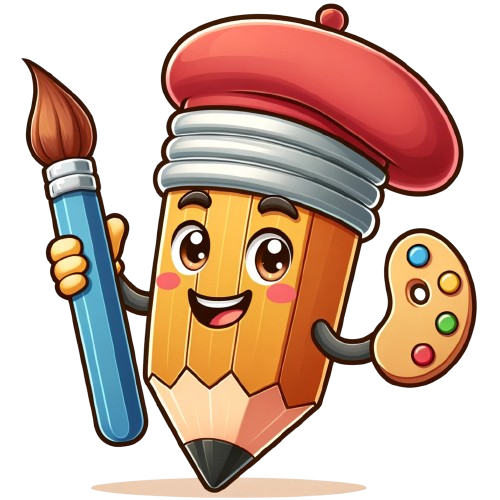
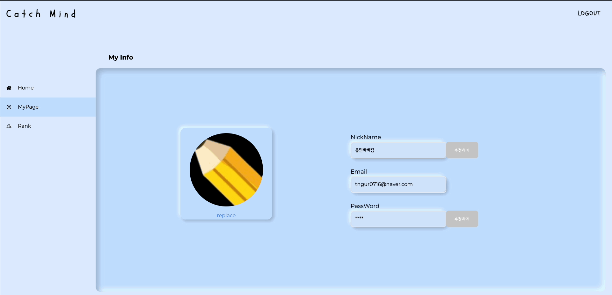
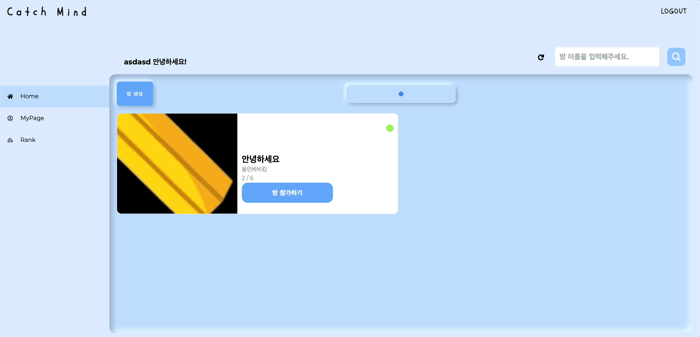
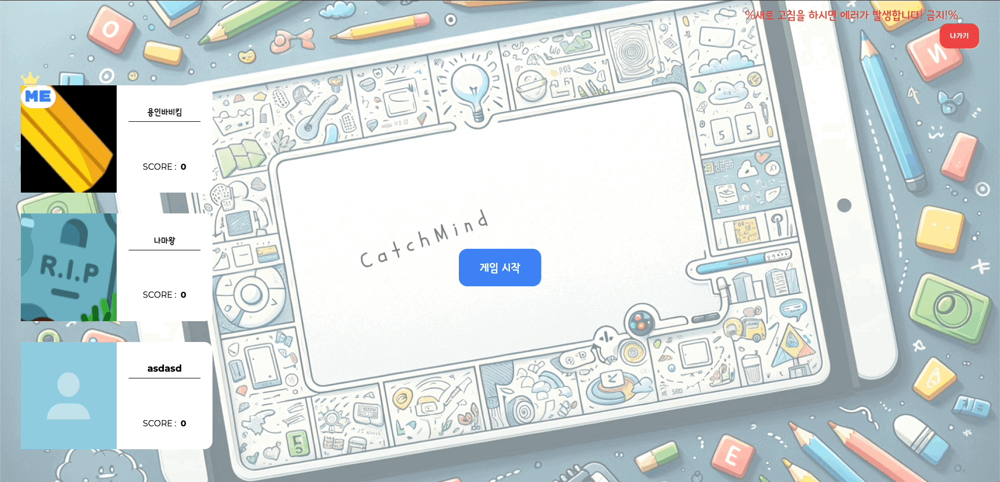
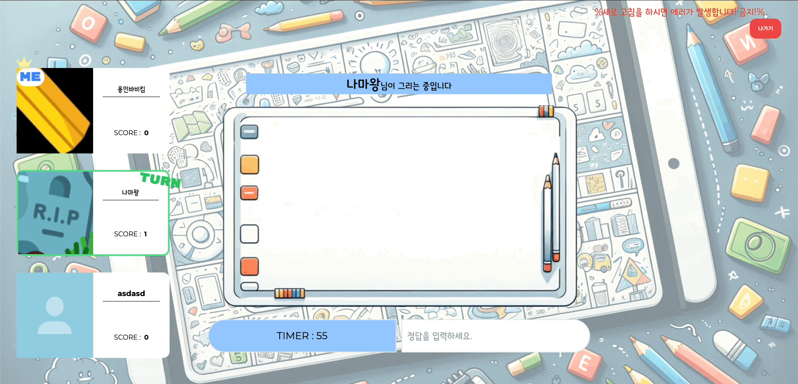
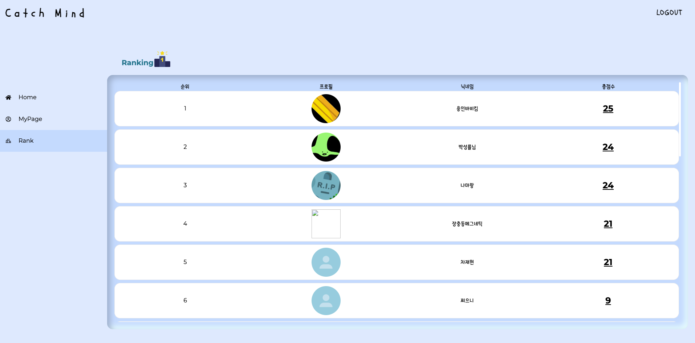
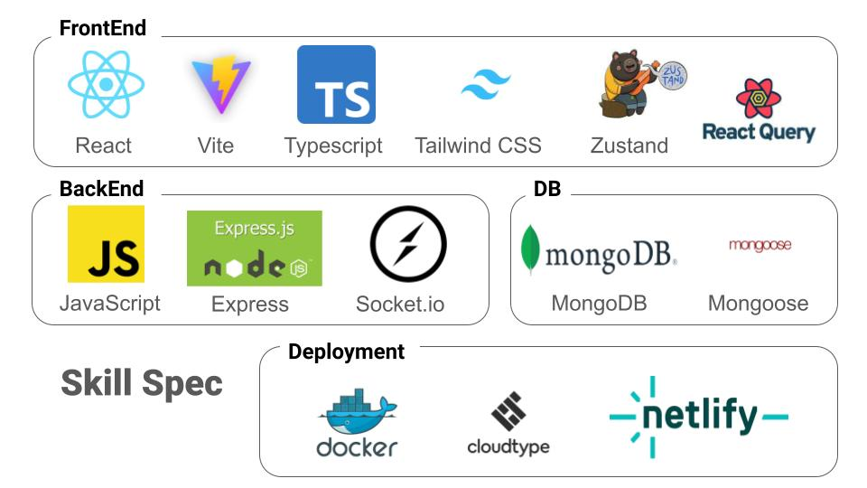

<div align="center">

<h1>캐치마인드 👊</h1>



<h3> "내가 그린 그림 맞춰봐!" </h3>

<br />

친구, 동료 등등 지인분들과 간단한 게임을 통해

짧은 순간의 재미를 느껴보세요!

한 걸음더 가까워 질 수 있습니다 👨🏿‍🤝‍👨🏿

</br>

[✨ 한게임 하러 가보실까요?](https://catchmind-program.netlify.app/)

</div>

<br />

# 목차

### [1. 프로젝트 소개](#%EF%B8%8F-프로젝트-소개)

- [<캐치 마인드>를 만들게 된 계기](#캐치-마인드를-만들게-된-계기)
- [주요 기능 설명](#주요-기능-설명)
- [프로젝트 실행 방법](#프로젝트-실행-방법)

### [2. 기술 스택](#%EF%B8%8F-기술-스택)

### [3. 기술적 경험](#-기술적-경험)

- [FE](#FE)

- [BE](#BE)

### [4. 팀원 소개](#%EF%B8%8F-팀원-소개)

### [5. 팀원 회고](#-팀원-회고)

<br />

# ⭐️ 프로젝트 소개

## < 캐치마인드 >를 만들게 된 계기

node.js 스터디를 하면서 socket 공부를 하게 되었고 , 이를 직접 프로젝트에 적용시켜보기 위해 어떤 프로젝트가 적합할지
생각하다. 캐치마인드가 적합한 프로젝트라고 생각하게 되었고. 직접 socket.io을 통해서 구현 시켜보았습니다.

<br />

## 주요 기능 설명

### [ 마이페이지 이미지 및 정보 수정 ]



- 마이페이지 부분에서 사진을 업로드해 crop해서 프로필 이미지를 등록 할 수 있습니다.
- nickname, email, password 수정이 가능합니다.

### [ 방 입장 ]



- 생성된 방에 입장하여 다른 사람들과 실시간으로 게임을 즐길 수 있습니다.
- 방을 생성할수도 있습니다.

### [ 게임시작 및 그림그리기 ]



- 게임이 시작된 후 그림을 제시어를 받고 제한 시간 안에 그림을 그려서 상대방과 실시간으로 게임을 합니다.

### [ 그림 맞추기 ]



- 상대방이 그리는 그림을 보고 실시간으로 상대방이 무엇을 그리고 있는 지 정답을 맞출 수 있습니다.

### [ 게임 종료 및 결과 모달 ]


- 3점을 달성한 유저가 있을시 게임을 종료합니다.
- 이번판 유저들이 얻은 점수를 모달로 확인 할 수 있습니다.

### [ 랭킹조회 ]



- 유저들이 서로 점수 경쟁을 할 수 있는 랭킹 시스템 입니다.

<br />

## 프로젝트 실행 방법

### Front-end

```bash
npm run dev
```

### Back-end

```bash
node app.js
```

<br />

# ⚒️ 기술 스택

<div align="center">

</div>

## Backend

<div align="center">
 

</div>
<br />
<div align="center">

</div>
<br />

## Frontend

<div align="center">
  <br />
    
</div>

<div align="center">


</div>

## DB

<div align="center">
   
</div>

<br>
<br>



# 💪🏻 기술적 경험

## FE

<br />

### R3F Camera

<br />

### 성능 최적화

<br />

## BE

**테스트와 쿼리 로그 분석을 통한 이유 있는 코드 작성**

### TDD, e2e 및 유닛 테스트

#### 학습 및 개발 기록

<br />

### 인증/인가

#### 학습 및 개발 기록

<br />

### 트랜잭션 제어, 쿼리 최적화

#### 학습 및 개발 기록

<br />

### NestJS Enhancers

#### 학습 및 개발 기록

<br />

### 배포 및 자동화

#### 학습 및 개발 기록

<br />

### admin 페이지 구현

<br />

# 🏃‍♂️ 팀원 소개

<table >
  <tr height="130px">
    <td align="center" width="130px">
      <a href="https://github.com/kwonsuhyuk"></a>
    </td>
    <td align="center" width="130px">
      <a href="https://github.com/nyh98"></a>
    </td>
    <td align="center" width="130px">
      <a href="https://github.com/chansik0504"></a>
    </td>
<td align="center" width="130px">
      <a href="https://github.com/jacknafa"></a>
    </td>
  </tr>
  <tr height="50px">
    <td align="center" width="130px">
      <a href="https://github.com/kwonsuhyuk">권수혁</a>
    </td>
    <td align="center" width="130px">
      <a href="https://github.com/nyh98">남용환</a>
    </td>
    <td align="center" width="130px">
      <a href="https://github.com/chansik0504">박성률</a>
    </td>
    <td align="center" width="130px">
      <a href="https://github.com/jacknafa">김준서</a>
    </td>
  </tr>
</table>

<br />

## 🐙 권수혁 (FE)

- 블로그: https://velog.io/@greencloud
- 깃허브: https://github.com/KimGaeun0806

## 🐧 남용환 (FE)

- 블로그: https://velog.io/@minboykim
- 깃허브: https://github.com/MinboyKim

## 👾 박성률 (BE)

- 블로그: https://velog.io/@qkrwogk
- 깃허브: https://github.com/qkrwogk

## ⚽️ 김준서 (BE)

- 블로그: https://velog.io/@songjseop
- 깃허브: https://github.com/SongJSeop

<br />

# 🍡 팀원 회고
